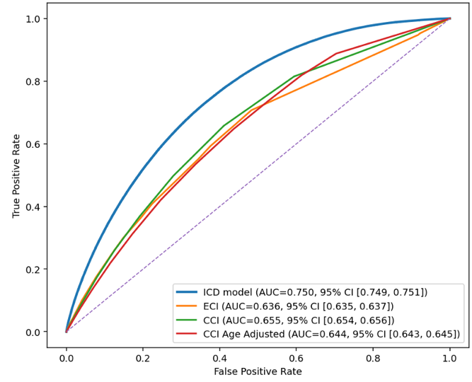
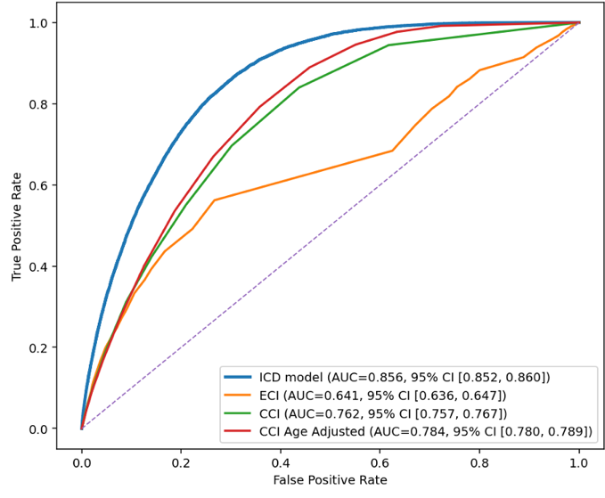
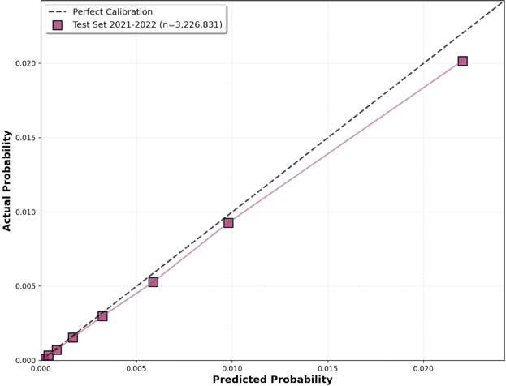
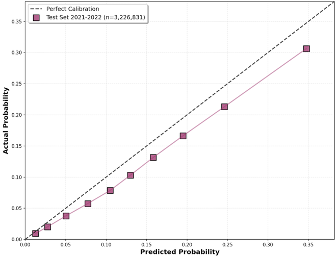
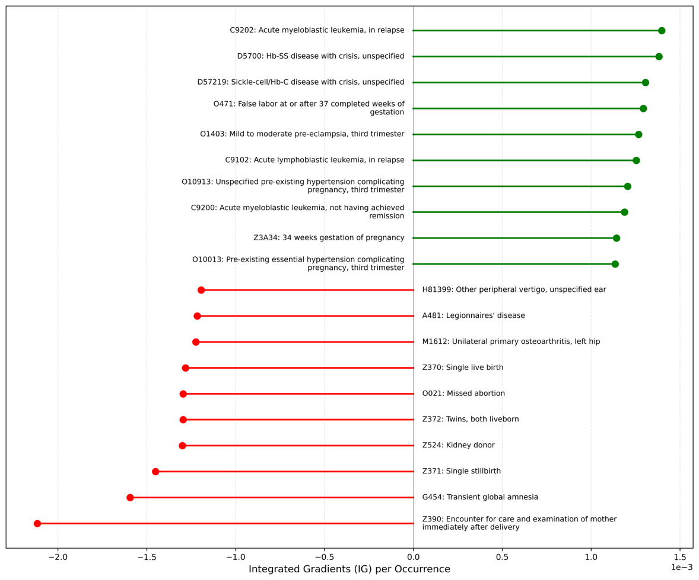
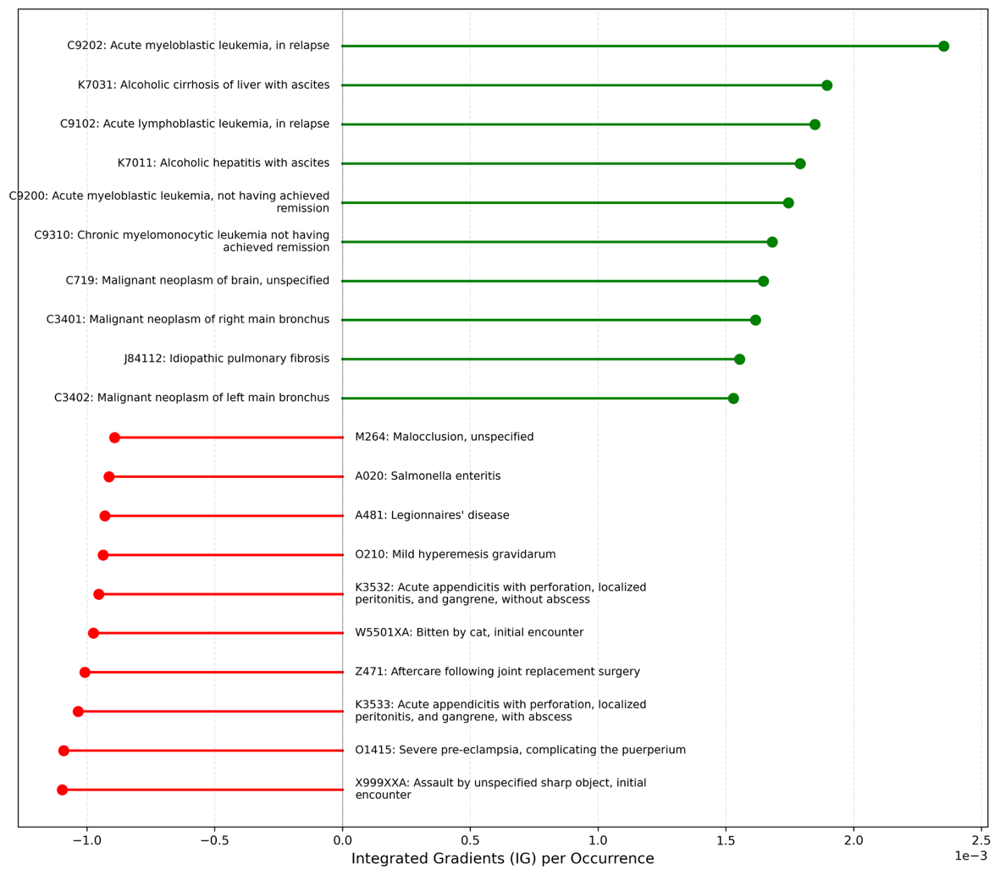
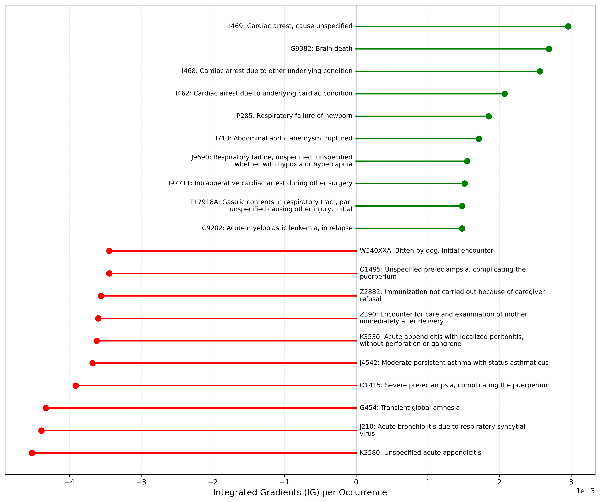
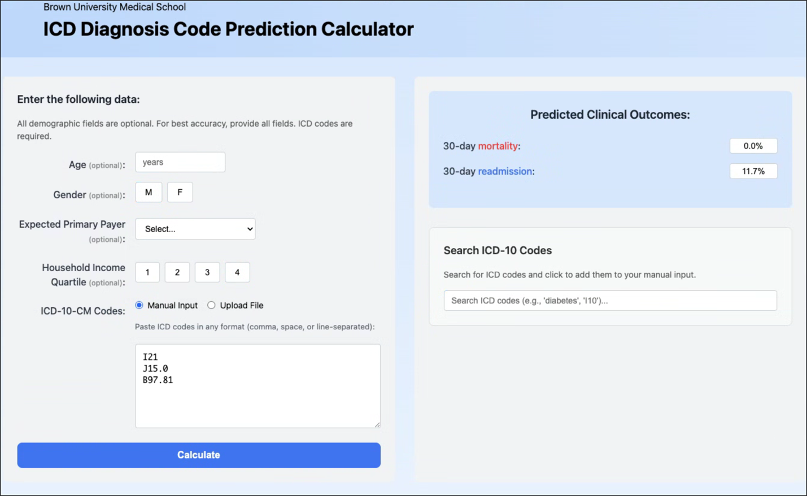
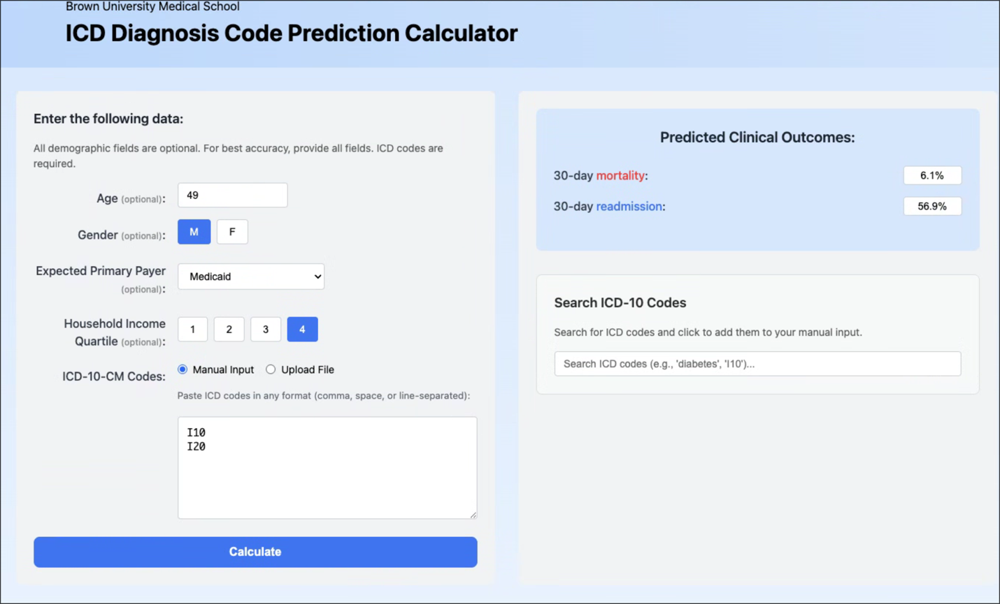

## Introduction (Background and Significance)

::: dropcap
Accurate prediction and risk adjustment for short-term clinical outcomes, such as 30-day mortality and readmission, are critical for enhancing healthcare research quality, allowing fair assessment of healthcare outcomes and quality metrics [@cms_hrrp]. Most claims-based risk adjustment continues to rely on comorbidity indices such as the Charlson Comorbidity Index (CCI) and Elixhauser Comorbidity Index (ECI), which map diagnosis codes to a limited set of conditions [@charlson1987; @elixhauser1998]. While these indices are interpretable and widely deployed, they inevitably discard granularity and may miss clinically meaningful comorbidity patterns and interactions among diagnoses.
:::

Recent machine-learning approaches increasingly use a set of ICD-10-CM diagnosis codes and have demonstrated improved prediction for a range of outcomes [@deschepper2020; @lelay2022; @qiao2022]. However, many approaches simplify or truncate ICD codes, aggregate diagnosis lists in ways that depend on code order, or are trained and evaluated in settings where coding practices differ across sites---each of which can limit generalizability across settings. In addition, many claims-based studies focus on in-hospital mortality and do not evaluate postdischarge mortality among outcomes relevant at the time of discharge [@qiao2022; @davis2022; @harerimana2021; @matsui2022; @nguyen2017].

In this study, we developed and temporally validated a claims-based deep learning model using ICD-10-CM diagnosis codes to predict 30-day unplanned readmission and 30-day postdischarge mortality in the Nationwide Readmissions Database. We compared its performance with benchmark models based on the Charlson and Elixhauser comorbidity indices, which are widely used for claims-based risk adjustment but were not originally designed for these specific outcomes. We also evaluated the model with different architectural design and examined diagnosis-level contributions to model predictions.

## Materials and Methods

### Study Design, Data Source, and Oversight

We conducted a retrospective cohort study using the Healthcare Cost and Utilization Project (HCUP) Nationwide Readmissions Database (NRD), 2016--2022. Adult discharges from 2016 through 2020 were used for model development, and a later temporally separated cohort from 2021 through 2022 was reserved for temporal validation. Discharges in December of each year were excluded to allow complete 30-day follow-up within the same calendar year.

Use of the NRD was governed by the HCUP data use agreement. Because the NRD contains deidentified data, the institutional review board determined the study was not human participants research and that informed consent was not required.

### Cohort Definition

We included hospitalizations for patients aged 18 years or older with a valid patient linkage identifier within each calendar year. For both the readmission and mortality analyses, index hospitalizations ending in in-hospital death were excluded because patients were not at risk for postdischarge outcomes. In-hospital death during the index hospitalization was examined in a prespecified secondary mortality analysis (eResults 1).

### Outcomes

The coprimary outcomes were (1) 30-day unplanned readmission and (2) 30-day postdischarge in-hospital mortality (hereafter, postdischarge mortality). Readmissions were classified as unplanned if they were coded as nonelective admissions in the HCUP database. Postdischarge mortality was defined as inpatient death occurring during a subsequent hospitalization within 30 days after discharge. Deaths outside the hospital are not captured in the NRD.

### Predictors

For each index hospitalization, we used up to 40 ICD-10-CM diagnosis codes (principal and secondary) and patient-level covariates (age, sex, primary payer, and ZIP-code median income quartile). Age was standardized, and categorical variables were represented using one-hot encoding. Analyses were restricted to records with nonmissing outcome ascertainment and complete covariates.

### Comparator Models

For benchmarking, we computed the Elixhauser Comorbidity Index (ECI) and Charlson Comorbidity Index (CCI) for each index hospitalization and treated each index as a continuous risk score [@charlson1987; @elixhauser1998]. The ECI identifies 30+ distinct conditions from administrative data, serving as a critical tool for risk adjustment in studies evaluating in-hospital mortality and short-term readmissions [@elixhauser1998; @ahrq_elixhauser; @fernando2019; @quan2005]. The CCI consolidates up to 19 comorbid conditions into a weighted numeric score, including variants that adjust for age, primarily predicting long-term mortality and readmissions [@charlson1987; @fernando2019; @quan2005; @deyo1992; @quan2011]. The ECI was computed using an ICD-10-CM--adapted AHRQ approach that identifies chronic comorbidities primarily from secondary diagnoses [@quan2005]. The CCI was computed using ICD-10-CM mappings to 17 comorbidity categories; both raw CCI and age-adjusted CCI were evaluated [@stagg2006]. These benchmark models used the index score alone as the predictor; age, sex, primary payer, and ZIP-code income quartile were not added separately. Discrimination and threshold-dependent classification metrics were derived directly from the score distributions, with operating thresholds selected on the validation set and then applied unchanged to the temporal test evaluation subsample.

### Model Architecture

We developed a deep learning framework that embeds each patient's diagnosis list along with demographic and socioeconomic information to predict the outcome. Each ICD-10-CM code was mapped into a dense vector representation through a learned numerical transformation. To obtain a single representation for each patient while avoiding reliance on diagnosis ordering, we used an aggregation approach that does not depend on code order:

$$f(x) = \rho\!\left(\sum_{x \in X} \phi(x)\right)$$

where $X$ denotes the set of embedded diagnosis vectors. Functions $\phi$ and $\rho$ were implemented as multilayer perceptrons with ReLU activations [@zaheer2017].

Demographic and socioeconomic variables were processed via a separate 2-layer multilayer perceptron. The resulting vector was concatenated with the aggregated diagnosis representation and passed through fully connected layers with ReLU activations and dropout regularization. A sigmoid output layer finally produced a predicted probability for each outcome.

### Model Development and Temporal Validation

Data from 2016--2020 were split into training (90%) and validation (10%) sets. For each outcome, models were trained to minimize binary cross-entropy loss. To address class imbalance, majority-class downsampling was applied during training (see Supplementary eMethods 1). Because majority-class downsampling altered the effective outcome prevalence in the training data, predicted probabilities were corrected using the original training-set prevalence before reporting calibration, temporal-test probabilities, and web-calculator outputs [@pozzolo2015]. This deterministic correction affects probability scaling but not rank-based discrimination. Hyperparameters (embedding dimension, Deep Sets depth/width, demographic tower width, predictor multilayer perceptron configuration, and dropout rate) were tuned using random search; the configuration with best validation AUROC (with recall-weighted metrics used as secondary criteria) was selected (see Supplementary eTable 1).

Temporal validation was based on eligible 2021--2022 discharges. To support computational feasibility while preserve outcome prevalence, primary performance evaluation was conducted in a prespecified stratified random subsample of the eligible 2021--2022 temporal test cohort, with 10% of outcome-positive and 10% of outcome-negative discharges sampled for each outcome (Supplementary eMethods 2). Models were implemented in Python using TensorFlow [@abadi2016].

### Performance Metrics

For threshold-dependent metrics, binary classification thresholds were selected on the validation set by maximizing the Youden index (sensitivity + specificity − 1) and then applied unchanged to the temporal test evaluation subsample for each model [@youden1950].

Because outcomes were imbalanced, we emphasized discrimination and precision--recall performance. Primary metrics included AUROC with 95% confidence intervals (CIs), average precision, precision, recall, $F_1$ score, and $F_2$ score (placing greater weight on recall).

### Statistical Analysis

AUROCs and their 95% CIs were estimated using DeLong's nonparametric method [@delong1988]. Pairwise comparisons in AUROC between the embedding model and each comorbidity-index comparator were performed using DeLong tests for correlated ROC curves [@delong1988]. Resulting $P$ values are unadjusted and interpreted alongside effect sizes and 95% CIs.

We conducted prespecified ablation analyses to estimate the incremental contribution of key model components, including addition of transformer blocks, replacement of the order-invariant Deep Sets aggregator with a permutation-variant flattening comparator, and removal of demographic and socioeconomic inputs; details are provided in Supplementary eMethods 4.

### Model Interpretation

We used Integrated Gradients (IG) to estimate code-level contributions to model predictions for each outcome [@sundararajan2017; @placido2023]. Attribution values were summarized at the ICD-10-CM code level, with positive values indicating higher predicted risk and negative values indicating lower predicted risk. To reduce instability from rare codes, ranked summaries were restricted to codes with at least 50 occurrences in the temporal test evaluation subsample. Additional implementation details are provided in Supplementary eMethods 3.

### Web Application

A public, read-only web calculator accepts discharge diagnosis lists and returns risk estimates with code-level explanations; inputs are not stored. The tool is intended for research and demonstration purposes rather than clinical decision-making. The calculator is available at: <https://levineuwirth.github.io/icd_embeddings/>. Implementation details are provided in Supplementary eFigure 4.

## Results

### Cohort size and event prevalence

The NRD included 80,217,696 discharges in 2016--2020 for model development and 33,322,761 discharges in 2021--2022 for temporal testing (Figure 1). After application of outcome-specific eligibility criteria, the validation cohort included 7,828,015 discharges. Primary performance evaluation was conducted in a prespecified stratified random subsample of 3,226,831 discharges from the eligible 2021--2022 temporal test cohort, and this evaluation subsample was not downsampled. For model training, majority-class downsampling was applied to address class imbalance, yielding analytic training samples of 17,200,994 discharges for the readmission analysis and 544,138 discharges for the postdischarge mortality analysis. In the temporal test evaluation subsample, 30-day unplanned readmission occurred in 362,696 discharges (11.2%), and 30-day postdischarge in-hospital mortality occurred in 13,071 discharges (0.4%).

### Model Performance

Detailed performance metrics for the ICD-10-CM--based model and benchmark comorbidity-index models are shown in Table 1. In the temporal test evaluation subsample, the ICD-10-CM--based model showed higher discrimination than comparator models for both 30-day unplanned readmission and 30-day postdischarge mortality (Figure 2). For readmission, the AUROC was 0.750 (95% CI, 0.749--0.750) for the ICD-10-CM--based model, compared with 0.655 (95% CI, 0.654--0.656) for the CCI model, 0.644 (95% CI, 0.644--0.645) for the age-adjusted CCI model, and 0.636 (95% CI, 0.635--0.637) for the ECI model. For postdischarge mortality, the AUROC was 0.856 (95% CI, 0.853--0.858) for the ICD-10-CM--based model, compared with 0.784 (95% CI, 0.781--0.787) for the best-performing comparator, the age-adjusted CCI model; the AUROC for the ECI model was 0.641 (95% CI, 0.636--0.647). DeLong tests comparing the ICD-10-CM--based model with each comorbidity-index comparator were significant for all pairwise comparisons ($P < .001$). Calibration curves showed overall agreement between predicted and observed risk for both outcomes, with greater deviation at higher predicted-risk ranges; this deviation was less pronounced for postdischarge mortality than for readmission (Figure 3).

At the prespecified threshold selected on the validation set, the ICD-10-CM--based model showed higher recall-weighted performance than comparator models, with $F_2$ scores of 0.485 vs 0.407 for 30-day readmission and 0.053 vs 0.048 for postdischarge mortality. Threshold-dependent metrics, including precision, recall, and specificity, are shown in Table 1. Because the classification threshold was selected using the Youden index, these metrics reflect a balance of sensitivity and specificity rather than optimization for a specific clinical use case. For readmission, these gains were accompanied by only modest precision, consistent with the difficulty of predicting this heterogeneous outcome.

In the prespecified secondary analysis expanding mortality to include in-hospital death during the index hospitalization, the ICD-10-CM--based model achieved an AUROC of 0.965 (95% CI, 0.965--0.966), exceeding that of the best-performing comparator model (age-adjusted CCI: AUROC, 0.750 [95% CI, 0.749--0.751]) (eTable 2).

### Ablation Studies

We evaluated a set of prespecified model variants that removed or augmented architectural components (eg, ICD-only inputs and insertion of transformer blocks) to estimate the incremental contribution of each element. We also compared the order-invariant aggregation approach with an order-dependent flattening-based aggregator to quantify any performance tradeoff attributable to enforcing invariance. In covariate ablation, removing demographic and socioeconomic inputs (age, sex, payer, and ZIP-income quartile) caused modest attenuation in performance (readmission AUROC, 0.750 vs 0.748; postdischarge mortality AUROC, 0.856 vs 0.848; similar $F_2$ scores), suggesting that diagnosis patterns captured most, but not all, of the predictive signal. Implementation details are provided in Supplementary eMethods 4; results are summarized in eTable 3.

### Feature Importance

ICD-10-CM codes with the 10 highest positive and negative contributions to both prediction outcomes are shown in Figure 4. For 30-day readmission, acute myeloblastic leukemia, in relapse (C9202), had the greatest positive contribution, whereas encounter for care and examination of mother immediately after delivery (Z390) had the greatest negative contribution. For 30-day postdischarge mortality, C9202 also had the greatest positive contribution, whereas assault by unspecified sharp object, initial encounter (X999XXA) had the greatest negative contribution. The most influential diagnosis codes for 30-day mortality prediction including inpatient death are shown in Supplementary eFigure 2.

## Discussion

In this national claims-based cohort study, a deep learning model using the full set of discharge diagnosis codes showed better discrimination than benchmark models based on Charlson and Elixhauser comorbidity indices for both 30-day unplanned readmission and 30-day postdischarge in-hospital mortality. The performance gain was larger for postdischarge mortality than for readmission. Performance remained favorable in a later, temporally separated NRD cohort, supporting robustness across subsequent years of the same database [@davis2020; @collins2024]. At the same time, these comparisons should be interpreted as benchmarking against widely used summary comorbidity approaches rather than as head-to-head comparisons with models purpose-built for these exact outcomes.

### Comparison with prior work

This pattern is consistent with the structure of the compared methods. Charlson and Elixhauser indices compress diagnosis information into a limited set of predefined conditions and were designed primarily for broad case-mix adjustment rather than high-resolution outcome prediction [@charlson1987; @elixhauser1998]. By contrast, the present model learns from the full diagnosis-code set and can represent co-occurrence patterns that are not captured by summary indices [@morgan2019; @beam2018]. Unlike many prior deep-learning approaches that depend on richer electronic health record inputs and site-specific preprocessing, this framework was designed for portability within claims-based settings by using routinely available diagnosis, demographic, and payer-related variables [@rajkomar2018]. This design also preserves the broader diagnostic context of each hospitalization rather than reducing diagnoses to fixed summary weights as ECI and CCI.

### Interpretability

Interpretability in this setting should not be viewed as an afterthought to an otherwise opaque model. Using Integrated Gradients, the model provided code-level attributions that were generally clinically plausible and helped explain why predicted risk increased or decreased for a given patient. For example, diagnoses associated with high treatment burden or advanced systemic illness, such as relapsed acute myeloid leukemia and alcoholic cirrhosis with ascites, tended to increase predicted risk, whereas postpartum encounters and some assault-related injuries tended to decrease it. These findings suggest that learning-based models can yield clinically meaningful information rather than functioning only as "black boxes," even when they are more flexible than traditional summary indices [@sundararajan2017; @placido2023; @rudin2019].

One plausible explanation for the performance gap between the present model and the Charlson and Elixhauser indices is that the prognostic contribution of a diagnosis is not fixed across patients. Summary comorbidity indices assign prespecified, static weights to diagnosis groups, effectively assuming that a given condition contributes similarly regardless of the broader diagnostic context. By contrast, in the present model, the contribution of a diagnosis could vary according to the full set of co-occurring diagnoses, which is more consistent with how risk is often understood clinically. We did not directly test this mechanism, so it should be interpreted as a hypothesis supported by the attribution patterns rather than as a proven explanation for the observed performance differences. Nevertheless, this dynamic view of diagnosis contribution may help explain why retaining the full diagnosis-code context improved prediction beyond summary comorbidity scores. As with other attribution methods, these explanations improve transparency but do not establish causality.

### Clinical and policy implications

These findings have two potential implications. First, in discharge-facing workflows, a claims-compatible model could be evaluated in read-only settings to identify patients who may warrant closer follow-up, medication reconciliation, or transitional-care outreach [@hansen2011; @coleman2006]. Second, in research and quality measurement, more granular use of diagnosis data may improve outcome prediction when summary comorbidity indices underrepresent diagnostic complexity [@joynt2013; @desai2016; @zuckerman2017]. This tool is intended for clinical prioritization and equitable quality measurement, not for coverage denial or utilization gatekeeping [@obermeyer2019].

Because demographic and socioeconomic factors are known to influence postdischarge outcomes, we assessed their incremental contribution beyond diagnosis patterns using ablation [@kind2014; @joynt2011]. Removing age, sex, payer, and neighborhood income produced minimal changes in performance, suggesting that much of the predictive signal available to this model was already captured by diagnosis patterns. This finding should not be interpreted to mean that demographic or socioeconomic factors are unimportant. Rather, within this claims-based framework, coded diagnoses may already capture part of the risk signal associated with demographic and socioeconomic differences, whether through differences in disease burden, comorbidity clustering, or patterns of healthcare use.

The public read-only calculator is intended for research and demonstration rather than clinical deployment. Future work should focus on external validation, prospective evaluation in read-only workflows, monitoring for coding and case-mix drift, and recalibration when needed [@davis2020; @collins2024; @collins2015].

### Limitations

This study has several limitations. First, the NRD captures deaths only during inpatient encounters; therefore, the mortality outcome reflects postdischarge in-hospital mortality rather than all-cause 30-day mortality. Second, claims data are subject to coding error and variation and do not directly capture functional status, physiologic severity, or many social risk factors. Third, although temporal validation in later NRD years reduces optimism, it is not a substitute for external validation, and performance may differ in other health systems or data sources with different coding practices, case mix, and discharge workflows. Fourth, this study evaluated predictive performance rather than downstream improvement in confounding control, hospital profiling, or other risk-adjustment applications; thus, better discrimination does not by itself establish superior risk adjustment, and because the model was trained specifically for 30-day unplanned readmission and postdischarge in-hospital mortality, performance may not generalize to other outcomes without separate validation. Fifth, Charlson and Elixhauser indices were included as benchmark comparators because of their widespread use in claims-based analyses, but they were not originally developed for these specific outcomes; accordingly, these comparisons should be interpreted as benchmarking rather than definitive head-to-head testing. Finally, attribution methods may improve transparency but do not establish causality [@rudin2019].

## Conclusions

A deep learning model using ICD-10-CM diagnosis codes improved prediction of 30-day unplanned readmission and 30-day postdischarge mortality compared with Charlson and Elixhauser comorbidity-index models in the Nationwide Readmissions Database. Prospective validation, drift monitoring, and attention to intended use will be essential before implementation for clinical decision support or policy applications.

## Data Sharing Statement

The study used de-identified data from the Healthcare Cost and Utilization Project (HCUP) Nationwide Readmissions Database under a data-use agreement. Data are available from HCUP to qualified researchers.

## Code Availability

The analytic code (including the non-elective readmission implementation, model training, and evaluation) will be made publicly available at publication in a GitHub repository (<https://github.com/Rice-wxl/icd-10-embedding>), with a versioned release tag/commit to support reproducibility. HCUP NRD data cannot be shared by the authors under the data-use agreement.

## Conflict of Interest Disclosures

The authors report no conflicts of interest related to this work.

::: aftermatter

## Tables

### Table 1: Performance metrics for the ICD model vs. CCI and ECI {#table-1}

Performance metrics for the ICD model vs. CCI and ECI for 30-day readmission (a) and 30-day postdischarge mortality (b) in the temporal test evaluation subsample.

**(a) 30-day readmission**

| Methods                        | AUC-ROC                      | Accuracy | Precision  | Recall     | $F_1$      | $F_2$      |
|:-------------------------------|:-----------------------------|---------:|-----------:|-----------:|-----------:|-----------:|
| ICD Model (Threshold: 0.5022)  | **0.7496** [0.7488, 0.7504]  |   0.5892 | **0.1881** | **0.8006** | **0.3046** | **0.4848** |
| CCI                            | 0.6553 [0.6544, 0.6562]      | **0.6962** | 0.1844   | 0.4973     | 0.2690     | 0.3713     |
| CCI Age-Adjusted               | 0.6444 [0.6435, 0.6453]      |   0.6479 | 0.1673     | 0.5360     | 0.2550     | 0.3720     |
| ECI                            | 0.6363 [0.6353, 0.6372]      |   0.5708 | 0.1598     | 0.6622     | 0.2575     | 0.4066     |

**(b) 30-day postdischarge mortality**

| Methods                        | AUC-ROC                      | Accuracy   | Precision  | Recall     | $F_1$      | $F_2$      |
|:-------------------------------|:-----------------------------|-----------:|-----------:|-----------:|-----------:|-----------:|
| ICD Model (Threshold: 0.4644)  | **0.8557** [0.8532, 0.8581]  |     0.6848 | **0.0111** | **0.8756** | **0.0220** | **0.0530** |
| CCI                            | 0.7621 [0.7585, 0.7657]      |     0.6987 | 0.0093     | 0.6963     | 0.0184     | 0.0442     |
| CCI Age-Adjusted               | 0.7844 [0.7813, 0.7874]      |     0.7352 | 0.0102     | 0.6700     | 0.0201     | 0.0480     |
| ECI                            | 0.6414 [0.6358, 0.6469]      | **0.7763** | 0.0089     | 0.4915     | 0.0175     | 0.0415     |

*Primary performance evaluation used a prespecified stratified random subsample of eligible 2021--2022 discharges. Classification thresholds were selected on the validation set by maximizing the Youden index and then applied unchanged to the temporal test evaluation subsample.*

## Figures

::: {.annotation .annotation--static}
**Figure 1 --- [placeholder]** Flow chart of discharge records in NRD for training, validation, and testing cohorts. Primary performance evaluation used a prespecified stratified random subsample of eligible 2021--2022 discharges. This temporal-test evaluation subsample was not downsampled. Classification thresholds were selected on the validation set by maximizing the Youden index and then applied unchanged to the temporal test subsample.
:::

**Figure 2.** Receiver operating characteristic (ROC) curves and area under the curve (AUC) for 30-day readmission and postdischarge mortality in the temporal test evaluation subsample. Each curve depicts the trade-off between sensitivity and specificity across different thresholds.

**Figure 3.** Calibration curves on temporal test evaluation subsample for 30-day readmission and postdischarge mortality.

**Figure 4.** Top influential ICD codes for model prediction. Mean Integrated Gradients attribution per occurrence (positive values indicate higher predicted risk; negative values indicate lower predicted risk).

## Supplement

### eMethods

1. **Training and Hyperparameter Tuning**
2. **Temporal Test Set Construction and Threshold Selection**
3. **Integrated Gradients for Code-Level Attribution**
4. **Ablation Analyses**
   1. Transformer Blocks
   2. Deep Sets vs Permutation-Variant Flattening Comparator
   3. Demographic and Socioeconomic Inputs

### eTables

1. **Hyperparameter Configurations Used in Models**
2. **Performance Comparison for 30-Day Mortality Including Index-Hospital Death**
3. **Ablation Study Results**
   - (A) Addition of Transformer Blocks
   - (B) Replacement of Deep Sets With Flattening Comparator
   - (C) Removal of Demographic and Socioeconomic Inputs (ICD-Only)

### eFigures

1. **Permutation-invariant ICD Embedding Model**
2. **Top ICD-10-CM Codes by Integrated Gradients for 30-Day Mortality Including Index-Hospital Death**
3. **Calibration Reliability Plots for Temporal Test Set Predictions**
   - 30-Day Readmission
   - 30-Day Postdischarge Mortality
4. **Web Calculator Interface Examples**

### eMethods 1. Training and Hyperparameter Tuning

Models were trained using batch size 128 for 10 epochs with the Adam optimizer at a learning rate of 2e-5. Early stopping was applied with patience of 2 epochs, retaining the checkpoint with the best validation performance. To address outcome imbalance, we randomly downsampled majority-class encounters in the training set to achieve a target case-control ratio of 1:1 (validation data and temporal test evaluation subsample were not downsampled). Because majority-class downsampling changes the effective outcome prevalence and can bias predicted probabilities, we performed adjustment with the original downsampling ratio of the training set and use the readjusted model outputs in all metrics/plots and for the web calculator. Random seeds for the train/validation split, downsampling, and model initialization were set to ensure reproducibility.

Hyperparameters were tuned via random search (32 trials per outcome). eTable 1 reports the selected configurations. Hyperparameter definitions: $d_{\text{embed}}$ (ICD embedding dimension); $d_{\text{hidden}}$ (Deep Sets hidden dimension); $r_{\text{deepset}} \times d_{\text{hidden}}$ (Deep Sets output dimension); $n_{\text{encode}}$ and $n_{\text{decode}}$ (numbers of Deep Sets encoding/decoding layers); $d_{\text{demo}}$ (first-layer width of the demographic/socioeconomic MLP; second layer set to $d_{\text{demo}}/2$); $d_{\text{mlp}}$ (first-layer width of the predictor MLP, halving each layer to a minimum of 32 over 4 layers); $r_{\text{dropout}}$ (dropout rate). Model selection prioritized validation AUROC; recall-weighted metrics (including $F_2$) were used as secondary criteria.

### eMethods 2. Temporal Test Set Construction and Threshold Selection

Temporal testing used eligible 2021--2022 data. To enable computationally feasible evaluation while preserving outcome prevalence, we created the temporal test evaluation subsample by stratified random sampling of the combined eligible 2021--2022 cohort, sampling 10% of outcome-positive and 10% of outcome-negative discharges for each outcome. This yielded approximately 3.2 million discharges for primary performance evaluation. Interpretability analyses used the same temporal test evaluation subsample.

Binary classification thresholds for each model were selected on the validation set by maximizing the Youden index (sensitivity + specificity − 1) and then applied unchanged to the temporal test evaluation subsample.

### eMethods 3. Integrated Gradients for Code-Level Attribution

Integrated Gradients (IG) was used to quantify code-level influence on model predictions. The baseline input was defined as a neutral input corresponding to an empty diagnosis list (ie, no diagnosis codes). The straight-line interpolation path from baseline to the observed input was discretized into 32 steps. At each step, gradients of the model logit were computed with respect to diagnosis embeddings; gradients were accumulated across steps and summed across embedding dimensions to yield a scalar attribution per code occurrence. Attribution values retained sign, with positive values indicating higher predicted risk and negative values indicating lower predicted risk. To reduce instability from rare codes, ICD-10-CM codes with fewer than 50 total occurrences in the temporal test evaluation subsample were excluded from ranked summaries. For each outcome, we reported the 10 codes with the largest mean positive attributions and the 10 codes with the largest mean negative attributions.

### eMethods 4. Ablation Analyses

#### eMethods 4.1 Transformer blocks

To evaluate whether attention-based contextualization improves performance, we added three multi-head transformer blocks operating over individual ICD embeddings. Each block followed a standard transformer design with multi-head attention, residual connections, normalization, and feed-forward sublayers. We used 3 attention heads, dropout 0.3, embedding dimension $d_{\text{embed}}$, and feed-forward dimension $4 \times d_{\text{embed}}$.

Comparative results are shown in eTable 3, Panel A. Across both outcomes, transformer blocks did not materially improve AUROC and $F_2$ score relative to the base model. Reported $P$ values for AUROC differences were $P < .001$ for readmission and $P = 0.57$ for postdischarge mortality.

#### eMethods 4.2 Deep Sets vs permutation-variant flattening comparator

To test whether permutation invariance via Deep Sets reduced predictive performance, we compared the base model with a permutation-variant alternative: a flattening layer that converts the 2-dimensional ICD embedding matrix into a 1-dimensional vector, followed by two MLP layers with $d_{\text{hidden}}$ and $r_{\text{deepset}} \times d_{\text{hidden}}$ units to mirror the Deep Sets hidden/output sizes.

Results are shown in eTable 3, Panel B. The base Deep Sets models outperformed the flattening comparators on AUROC and $F_2$ score. Reported $P$ values for AUROC differences were $P < .001$ for readmission and $P = 0.014$ for postdischarge mortality.

#### eMethods 4.3 Demographic and socioeconomic inputs

To evaluate the incremental value of non-diagnosis covariates, we removed the 2-layer demographic/socioeconomic MLP and trained ICD-only variants.

Results are shown in eTable 3, Panel C. ICD-only variants had slightly worse AUROC and $F_2$ score. Reported $P$ values for AUROC differences were $P = 0.020$ for readmission and $P < .001$ for postdischarge mortality.

### eTable 1: Hyperparameter configurations used in models

| Outcome                                           | $d_{\text{embed}}$ | $d_{\text{hidden}}$ | $r_{\text{deepset}}$ | $n_{\text{encode}}$ | $n_{\text{decode}}$ | $d_{\text{demo}}$ | $d_{\text{mlp}}$ | $r_{\text{dropout}}$ |
|:--------------------------------------------------|---:|----:|----:|---:|---:|---:|----:|----:|
| 30-day readmission                                | 32 | 416 | 0.5 | 1  | 3  | 64 | 480 | 0.1 |
| 30-day postdischarge mortality                    | 64 | 320 | 0.6 | 2  | 1  | 64 | 384 | 0.1 |
| 30-day mortality including index-hospital death   | 64 | 416 | 0.8 | 3  | 3  | 64 | 448 | 0.4 |

*The model configurations are determined through hyperparameter tuning for each outcome variable, respectively. All models share the same batch size and learning rate.*

### eTable 2. Performance comparison for 30-day mortality including index-hospital death

| Methods          | AUC-ROC                  | Precision | Recall | $F_1$  | $F_2$  |
|:-----------------|:-------------------------|----------:|-------:|-------:|-------:|
| ICD Model        | 0.9651 [0.9647, 0.9656]  | 0.2107    | 0.9165 | 0.3427 | 0.5489 |
| CCI              | 0.7217 [0.7203, 0.7231]  | 0.0663    | 0.6270 | 0.1200 | 0.2331 |
| CCI Age-Adjusted | 0.7501 [0.7489, 0.7513]  | 0.0724    | 0.6043 | 0.1294 | 0.2448 |
| ECI              | 0.6158 [0.6139, 0.6177]  | 0.0637    | 0.4427 | 0.1114 | 0.2022 |

### eTable 3. Ablation study results

**(A) Addition of transformer blocks**

| Outcome Variable               | Model Variant        | AUC-ROC | AUC-ROC CI       | Precision | Recall | $F_1$  | $F_2$  |
|:-------------------------------|:---------------------|--------:|:-----------------|----------:|-------:|-------:|-------:|
| 30-day readmission             | Full Model           | 0.7496  | [0.7488, 0.7504] | 0.1881    | 0.8006 | 0.3046 | 0.4848 |
|                                | 3 Transformer Blocks | 0.7472  | [0.7464, 0.7479] | 0.1974    | 0.7565 | 0.3131 | 0.4829 |
| 30-day postdischarge mortality | Full Model           | 0.8557  | [0.8532, 0.8581] | 0.0111    | 0.8756 | 0.0220 | 0.0530 |
|                                | 3 Transformer Blocks | 0.8547  | [0.8523, 0.8572] | 0.0114    | 0.8662 | 0.0225 | 0.0542 |

**(B) Replacement of Deep Sets with flattening comparator**

| Outcome Variable               | Model Variant   | AUC-ROC | AUC-ROC CI       | Precision | Recall | $F_1$  | $F_2$  |
|:-------------------------------|:----------------|--------:|:-----------------|----------:|-------:|-------:|-------:|
| 30-day readmission             | Full Model      | 0.7496  | [0.7488, 0.7504] | 0.1881    | 0.8006 | 0.3046 | 0.4848 |
|                                | Without DeepSet | 0.7474  | [0.7466, 0.7482] | 0.1933    | 0.7724 | 0.3092 | 0.4829 |
| 30-day postdischarge mortality | Full Model      | 0.8557  | [0.8532, 0.8581] | 0.0111    | 0.8756 | 0.0220 | 0.0530 |
|                                | Without DeepSet | 0.8513  | [0.8488, 0.8538] | 0.0108    | 0.8777 | 0.0214 | 0.0515 |

**(C) Removal of demographic and socioeconomic inputs (ICD-only)**

| Outcome Variable               | Model Variant   | AUC-ROC | AUC-ROC CI       | Precision | Recall | $F_1$  | $F_2$  |
|:-------------------------------|:----------------|--------:|:-----------------|----------:|-------:|-------:|-------:|
| 30-day readmission             | Full Model      | 0.7496  | [0.7488, 0.7504] | 0.1881    | 0.8006 | 0.3046 | 0.4848 |
|                                | ICD Inputs Only | 0.7483  | [0.7475, 0.7490] | 0.1907    | 0.7868 | 0.3070 | 0.4842 |
| 30-day postdischarge mortality | Full Model      | 0.8557  | [0.8532, 0.8581] | 0.0111    | 0.8756 | 0.0220 | 0.0530 |
|                                | ICD Inputs Only | 0.8483  | [0.8457, 0.8509] | 0.0110    | 0.8627 | 0.0218 | 0.0525 |

### eFigure 1: Permutation-invariant ICD Embedding Model

### eFigure 2: Top ICD-10-CM codes by Integrated Gradients for 30-day mortality including index-hospital death

### eFigure 3. Calibration reliability plots for temporal test evaluation subsample predictions

*(A) 30-day unplanned readmission and (B) 30-day postdischarge mortality.*

::: {.annotation .annotation--static}
**eFigure 3 --- [placeholder]** Calibration reliability plots for temporal test evaluation subsample predictions.
:::

### eFigure 4. Web Calculator Interface Examples

*(A) With demographics and (B) Without demographics.*

**(A)**

**(B)**

:::
