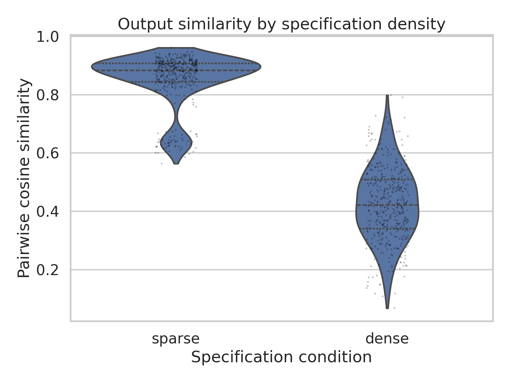

There are at least two distinct ways to reduce the search space over which AGI^[The definition of "Artificial General Intelligence", or whether such a definition exists, is contentious. My use of the term is not intended to endorse any proposed timeline for AGI, nor to suggest that it is inevitable. It is rather to provide calibration through a hypothetical goal that clearly justifies pursuit.] will have to operate. The first involves a harmonious interaction of agent and human, not transactional in origin, not fully autonomous nor fully human-driven, but rather collaborative in nature - the agent augments the capacity of the human, just as any other good tool for thought does, by working within the scope of something well specified and ideated upon. This is not to say that the agent cannot have a place in such planning, but rather that the human is ultimately the driver of the actions and tasks, defining the scope of what is to be done in as much detail as possible without being the one to actually do it.

The second is a starkly different picture: the human, who only has a vague idea of their own intentions and has not thought over this much, jumps straight into the work of creating via the agent, without thought on the nature of their specification. The agent is forced to infer the majority of the details, make the majority of the decisions, and the human makes none. We may already be seeing this with [Vibe Coding](https://en.wikipedia.org/wiki/Vibe_coding), but as we continue scaling to AGI, I foresee it happening widely across all sorts of domains^[Some have argued of late that "only the humanities will survive", but I am not so optimistic. If AGI does interact with us in the latter reductive manner that I describe here, then the humanities will be stripped of anything that actually makes them human, at least for the majority of participants.].

These two represent diverging definitions of *intelligence*, both for the models and for their users, or, if you prefer, their collaborators. The first is a definition of intelligence that depends both on what one has the capacity to specify and what one has the capacity to see through. The latter depends wholly on what one has the capacity to see through, and places even more emphasis on this metric than the first, for the amount of recalibration and prompt adjustment necessary to build a specification continuously throughout the duration of a task is always greater than paying the upfront cost of developing a strong specification from the onset. [We the programmers have known this for years](https://en.wikipedia.org/wiki/Hofstadter%27s_law). The first future is chiefly preferable, and the second, which seems to be the unfortunate reality we are racing towards, is not only a realization of the worst affect that AI could have on our cognition, but may also unnecessarily constrain the breadth of intelligence that AGI can achieve.

## The Mechanism

Your prompt, or, as we will call it in this writing, *specification*, is information that characterizes what you want. If you provide 10 bits of information to an LLM, and your task requires 10,000 bits, then 9,990 bits have been filled in by the model's priors, priors that are invariant across users. If two users with similar endgoals and similar prompts each contribute their own unique 10 bits and have the same LLM complete the rest, then 9,990 of the bits are shared between their final results, assuming no revision. If 5,000 bits were provided by each user, then 5,000 bits are invariantly shared due to the LLM, and 5,000 bits are contributed from each user. The user contributions, even for two very similar people (eg. immediate family members) will be vastly different. The extent of homogeneity in a future where LLMs are widely used, then, can be expressed by the ratio of shared-to-unique content. We empirically probe this below.

Someone might object that any specification, regardless of how few bits it encodes, carries injected information that is the result of preference, taste, constraint - factors we may largely group as environmental. A specification is always highly specific in some way, cultivated from a unique perspective shared by no one else. This is true, but this specificity alone is insufficient to prevent an end behavior of homogeneity. What is required is *density* - more information must be encoded in your specification^[This parallels nicely with the [Scaling Hypothesis](https://gwern.net/scaling-hypothesis), which I postulate extends to all forms of intelligence and not merely neural nets.]. The act of providing any information in the formation of a specification at all inherently leaks some information about your preferences and your environment into said specification, but the leaked information is small relative to the model-supplied content. Density, not specificity, is what determines the ratio.

A serious threat emerges: if the societal trend is towards greater autonomy, towards the second definition of intelligence proposed above, then the inevitable result is convergence to absolute homogeneity. This convergence is the result of a [positive feedback loop](https://en.wikipedia.org/wiki/Positive_feedback); as the average density of a specification selected at random from all specifications produced per some unit time decreases, the amount that is filled by invariant priors increases, resulting in a greater overall state of homogeneity, one that accelerates the progression towards absolute convergence. Another way of saying this: the [span](https://en.wikipedia.org/wiki/Linear_span) of what ideas Humanity can feasibly reach is reduced.^[In the worst case, this reduction is irreversible, but given the current volatile nature of the "AI Industry," this is hardly a given.]

## Substantiation

I ran a probe to attempt to falsify my hypothesis, keeping well in mind that intuitions about emergent statistical behavior are always at best considered dangerous tides. The design was as follows: thirty imagined users each brought a distinct underlying intent to an LLM. These intents spanned their audiences, their personal voices, their structural constraints, etc. Each user contributed two prompts, one dense (200 words, specifying their intent to the best extent possible in this word count) and one sparse (a conversational summary of what was intended). This structure of matched-pairs was deliberately chosen to show that any divergence in the output distributions is attributable to specification completeness rather than to the underlying users wanting different things. Outputs were generated against a strong open-weights model, embedded, and compared pairwise within each condition.

The sparse outputs converged tightly as expected, with a mean pairwise [cosine similarity](https://en.wikipedia.org/wiki/Cosine_similarity) of 0.85. In contrast, the dense outputs diverged, with similarity 0.43. The numbers are large enough that suspicion is still warranted, so I present some qualitative confirmation. What follows are two sparse openings picked at random from the dataset of 30.

<blockquote>
    
The Future of Work Is Flexible: Embracing Remote Work in 2024 and Beyond. Remember when the idea of working from your couch seemed like a distant dream? Just a few short years ago, remote work was a rare perk — something only freelancers and tech startups talked about. Today? It's become the new normal for millions of workers around the globe...

</blockquote>

<blockquote>
    
The Remote Work Revolution: Embracing the Future of Productivity. The way we work has undergone a dramatic transformation over the past several years, and remote work has emerged as a defining characteristic of modern professional life. What began out of necessity for many has evolved into a preferred working arrangement for millions around the world...

</blockquote>

When I manually reviewed the results, I found them staggering. These were two different users with entirely different intents, different backgrounds, different constraints, different environments, and yet the same generic blog that you've probably read a thousand times^[Seriously, did I *really* need to run this experiment when just about every Substack blog you can think of is entirely generated by Opus at this point? I think not...] is the result. A prototypical [Markdown](https://en.wikipedia.org/wiki/Markdown) header, shared "future of work" thesis concerning "millions" specifically, you get the point. You can see the full results of my run in the Appendix below; I firmly believe you will find them as staggering as I still do.

## Shared Water

<figure class="prose-excerpt">
<blockquote>

For the change that occurs marks the soul in a sort of way, like a seal-ring. Therefore those who are strongly moved by passion or by youth do not remember, just as if the seal were applied to running water. In others, because of their being worn out, like old buildings, or because of the hardness of what receives the impression, no impression is made.

</blockquote>
<figcaption>Aristotle — <em>De Memoria et Reminiscentia</em></figcaption>
</figure>

There is a common framing, one that is perhaps growing more prevalent in the public sentiment, that LLM use significantly atrophies individual cognitive ability. There exists [literature](https://arxiv.org/abs/2506.08872) that, at least to an extent, demonstrates this is true. People who outsource engagement with the problems they face which require them to specify what they want - a desired outcome - are doing less thinking, and the atrophy is legitimate. It should be clear that this is problematic: if we outsource *all* problems where we can specify a desired outcome, then we have outsourced in some brute fashion the essence of human creativity.

This is the wrong angle to criticize LLM usage from, however. Consider the invention of writing. We have offloaded nearly all of what would have once resided in our memory to being written down, allowing for convenient retrieval. This process of offloading has not negated our capacity to understand what is written down deeply, to be the wax seal forever affected as Aristotle suggested. Every Tool for Thought that has ever been invented and widely adopted has involved some amount of offloading. This process of offloading, in an ideal world, is not detrimental to the reach of human cognition, but rather augments it, allowing for pinpointed focus on the aspects of our intellect that make us so uniquely positioned within the Universe.

The argument is not only thus fundamentally misconstructed, but it is also simultaneously too weak, precisely because of its mischaracterization of the problem. Homogenization does not care about individual characters, but rather the whole of society over a longer period of time. Even if every user of an LLM in any capacity retained 100% of their cognition, reaping all of the benefits without any downsides in this hypothetical scenario, the end behavior of homogenization still remains inevitable, and through the feedback loop, it harms us at a population level. This process is entirely agnostic to the impacts of LLM usage on cognition. It does not matter whether any given individual's cognition has declined; it only matters that many individuals use the same priors to fill gaps in their specifications.

A cautious individual who realizes they have fallen too far and developed a reliance on an LLM can easily make the conscious decision to stop using the technology, or, at a minimum, to investigate and deeply reconsider the nature of their interaction with the tool. The miracle of [neuroplasticity](https://en.wikipedia.org/wiki/Neuroplasticity) will allow this careful individual to recover; their cognitive habits and initiative will be restored eventually. What the careful individual cannot do is to recover the shared cultural water in which they swim.

What happens when the priors of an entire generation are deeply influenced by the invariant priors of the most abundant LLM models? We have seen that the priors of a generation can vary widely from the generations that surround it - I myself live in the most potent example of this, being the first generation entirely comprised of people younger than the internet. When the next generation has been born into a world so extensively influenced by the LLMs that their priors are essentially those of the LLMs, then even those children who grow up without ever touching an LLM - perhaps the children of the cautious individual above, who has realized what is occurring and sprinted in the opposite direction - have had their priors set for them. They will live in a world where prose is written by those who have gradually eroded away their capacity to specify; they will work within a labor pool that is the residual of one trained on AI-mediated work, and they will navigate an aesthetic and artistic landscape whose modes have collapsed entirely. The same homogenized outputs that doomed this generation will go on to become the foundational inputs to the next series of frontier models, and so on. The priors do not just persist, but they rather compound, accelerating the race towards convergence until, in another showing of that inevitable [second law of thermodynamics](https://en.wikipedia.org/wiki/Second_law_of_thermodynamics), we diffuse what was once a vibrant, heterogeneous society into the state of maximum entropy.

## Coda: What is Lost

What does it mean for AGI, the technology that has in principle been sought after and dreamed of for centuries, that the feedback loop has resulted in compounding priors? A model whose training distribution has narrowed has fewer modes to draw upon, fewer rare patterns to learn from, and a vastly reduced surface area for the capabilities that emerge from genuine variance and diversity in human thought. Scaling intelligence up to AGI is contingent on scaling the space over which our architecture operates and with which it scales. For us to achieve our technological imperative requires that we do not shrink the intellectual space within which such an imperative could exist.

For us to avoid shrinking such an intellectual space requires the first mode of intelligence, for it preserves the essential quality of variance that the second mode destroys through its resultant homogeneity. An individual who specifies is carrying out the work of their essence, procuring themself through the act of cognition. Not only does such a collaboration between LLM and individual augment the capacity of that individual, but it increases the intellectual space within which the intelligence is confined. The boundaries are pushed further outward in some distinctly human way, the training pipeline towards AGI is improved and nourished with quality data, and the subsequent innovations and frontier models reach further than we could have previously imagined.

The mode that wins will simply be the one that the most people use. Most people are choosing the one that asks less of them.

::: aftermatter

## Appendix: Thinking-Run Results

The pre-registered probe of specification sparsity returned a strong positive result on its first complete run. Across 30 matched-pair imagined users, sparse-condition outputs converged tightly in semantic embedding space (mean pairwise cosine 0.853) while dense-condition outputs diverged (mean pairwise cosine 0.425). Cohen's *d* = 3.91; the output-level bootstrap 95% CI on the difference excludes zero by a wide margin: [0.347, 0.473]. All pre-registered falsification criteria are met by many orders of magnitude. The result is qualitatively visible in the texts themselves: sparse outputs are recognizably the same generic blog post in different words, while dense outputs are doing the different things their prompts asked them to do.

### Pre-registered Criteria

The hypothesis: as user specification becomes sparser, semantic similarity across outputs from plausibly-varied prompts increases, because the model's shared priors fill the under-specified space. The thinking-run results meet every pre-registered falsification criterion:

- Sparse-condition mean pairwise cosine (0.853) is meaningfully higher than dense-condition mean (0.425).
- Cohen's *d* = 3.91, well past the *d* > 0.8 threshold for a positive result.
- *p* < 0.01 on both naive Welch and Mann–Whitney tests by many orders of magnitude.
- The output-level bootstrap 95% CI on the difference in mean similarity is [0.347, 0.473], excluding zero.

### Method

A two-condition design with matched pairs at the user level. Thirty imagined users with distinct underlying intents (audience, thesis, tone, voice, opening move, structural constraint) each contributed two prompts: a sparse prompt (5–20 tokens, topic only, in their natural register) and a dense prompt (150–300 tokens, full intent). The two conditions sample the same population of intents, so any divergence between the similarity distributions is attributable to specification completeness rather than to differences in the underlying user populations.

The model was `qwen3.5-27b` served via LMStudio's OpenAI-compatible local server. Generation parameters were held constant across all 60 prompts: temperature 0.7, top-*p* 0.95, `max_tokens` 8000 (raised from the spec's original 500 to accommodate the reasoning budget of a thinking model; see Methodology Notes below). Outputs were embedded with `sentence-transformers/all-mpnet-base-v2` and L2-normalized; pairwise cosine similarities were computed within each condition, yielding $\binom{30}{2} = 435$ pairs per condition.

### Tables

#### Table 1: Descriptive statistics {#table-1}

|                       | Sparse (*N* = 30) | Dense (*N* = 30) |
|:----------------------|------------------:|-----------------:|
| Mean pairwise cosine  | 0.853             | 0.425            |
| Median                | 0.884             | 0.423            |
| Std. deviation        | 0.090             | 0.126            |
| Number of pairs       | 435               | 435              |

#### Table 2: Inferential statistics {#table-2}

| Metric                                     | Value                |
|:-------------------------------------------|---------------------:|
| Cohen's *d* (pooled SD)                    | 3.91                 |
| Welch *t*                                  | 57.66                |
| Welch *p*                                  | $\approx 1\times10^{-284}$ |
| Mann–Whitney *U*                           | 187,873              |
| Mann–Whitney *p*                           | $\approx 1\times10^{-140}$ |
| Bootstrap point estimate (sparse − dense)  | 0.428                |
| Bootstrap 95% CI                           | [0.347, 0.473]       |
| Bootstrap iterations                       | 10,000               |

### Figures

**Figure 1.** Output similarity by specification density. Pairwise cosine similarities are plotted for each condition; each violin shows the within-condition distribution of all $\binom{30}{2} = 435$ pairs.

The sparse distribution is dominated by a tight upper mode at cosine 0.85–0.95 — the convergence the hypothesis predicts. The smaller satellite cluster around 0.6–0.7 comes from two mildly off-pattern sparse outputs (per-output mean cosine ≈ 0.64 to the rest of the sparse mass); both are still recognizably "a remote-work blog post," just slightly off-archetype from the main mode. The dense distribution is a single broad blob centered near 0.42 — outputs genuinely diverging across the 30 different specifications, exactly as the matched-pairs design predicts when the prompts actually push the model.

### Qualitative Confirmation

The two sparse openings shown in the body convey the convergence; for the contrast, two dense openings on the same task produced markedly different texts:

<figure class="prose-excerpt">
<blockquote>

The thing you miss most isn't meetings. It's the sound of someone else figuring something out. Three years into remote work, I've stopped noticing the absence of conference rooms. What I notice is that my desk faces a wall. Not metaphorically — the monitor is three feet from drywall, and the only sound during "deep work" hours is the refrigerator humming in the kitchen...

</blockquote>
<figcaption>Dense output, imagined user 0 — mid-career engineer, ambient-learning thesis</figcaption>
</figure>

<figure class="prose-excerpt">
<blockquote>

The Infrastructure of Solitude. I want to open with Thoreau because he's the obvious choice but also the right one — he is, after all, the patron saint of anyone who has ever imagined that the antidote to modern life might be a small cabin, a woodstove, and the luxury of one's own silence...

</blockquote>
<figcaption>Dense output, imagined user 1 — literary essayist, Thoreau-led structural directive</figcaption>
</figure>

These are doing different things. The first is the dry mid-career-engineer voice landing on the ambient-learning thesis exactly as its dense prompt asked; the second is the literary essayist actually opening on Thoreau exactly as its dense prompt asked. The dense prompts pushed the model into genuinely different regions of output space. The sparse prompts, by contrast, collapsed onto a single mode despite specifying a different imagined user behind each one.

### Methodology Notes and Caveats

**Thinking-mode artifact.** `qwen3.5-27b` is a reasoning model, and the LMStudio MLX backend on the available host did not honor the `enable_thinking` chat-template kwarg through the OpenAI-compatible API. The model therefore reasoned (typically several thousand tokens) before producing visible output for every generation. `max_tokens` had to be raised from the originally-specified 500 to 8000 to leave room for both reasoning and the ~300-word visible output. A planned no-thinking run — once the LMStudio-side toggle is identified — will provide the apples-to-apples complement.

**Empty-output regenerations.** The first complete run at `max_tokens` = 4000 produced 12 empty completions (5 sparse, 7 dense): the model used the full budget on reasoning and never reached visible output. After bumping to 8000 and re-running only the failed prompts (resume logic preserves successful generations), 11 of 12 succeeded. The last (the freelancer/contractor prompt with a Q&A structural directive) required a final retry under the same configuration to produce content. All 60 generations in the reported analysis are non-empty.

**Seed not honored.** The LMStudio MLX backend did not honor the `seed` parameter for this model: two requests with the same seed produced different non-empty outputs in the smoke test. The saved generations therefore represent one realization rather than a canonical reproducible run. With *N* = 1 generation per prompt and the analysis comparing distributions rather than point estimates, this loses replication tidiness but does not affect the validity of the conclusion.

**Pre-registered design.** The 30 sparse and 30 dense prompts were frozen in version control before any generation; no prompt was iterated on after seeing model output. The matched-pairs structure (sparse prompt *i* and dense prompt *i* share an imagined user / underlying intent) controls for the distribution of intents across conditions.

**Single-task, single-model, single-metric.** The experiment fixes the task ("opening 300 words of a blog post about remote work"), the model (`qwen3.5-27b` in thinking mode), and the embedding model (`all-mpnet-base-v2`).
:::
