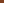

# Opening section

Plain prose with "smart quotes" -- an en dash --- an em dash, and an
ellipsis... Abbreviations: e.g. this, i.e. that (cf. the other), and one
ending a line, e.g.
here, and one with a comma, i.e., like so. Then
here. NASA and
HTML go to small caps, and so does [explicit]{.smallcaps} text.

A cited claim [@alpha2001] and a cluster [@beta2010; @alpha2001], then the
first book again [@alpha2001, p. 4]. The book is also listed for further
reading, which is the case that once cost its first citation its anchor.

A note.^[A sidenote with a [link](https://en.wikipedia.org/wiki/Footnote)
and math $a+b$.] A second note.^[The second note cites [@beta2010].]

## Links

- external with an icon: [Wikipedia](https://en.wikipedia.org/wiki/Typography)
- external without one: [Example](https://example.org/page)
- internal: [the colophon](/colophon.html), and [a section](#links)
- a PDF: [the paper](/papers/fixture.pdf)
- mail: [write](mailto:someone@example.org)
- wikilinks: [[Golden Page]] and [[Golden Page|shown differently]]
- a source reference: `build/Filters/Links.hs`

## Code and math

```python
print("[[not a wikilink]]")
{{not-a-transclusion}}
```

Inline $e^{i\pi} + 1 = 0$, and display:

$$\sum_{k=1}^{n} k = \frac{n(n+1)}{2}$$

## What "consumed" means, e.g. for $K_4$

A heading with quotation marks, an abbreviation Typography wraps in
`<abbr>`, and math: the TOC entry must keep all three (audit H03).

## Embeds

{{golden-page}}

{{golden-page#a-section}}

{{pdf:/papers/fixture.pdf}}

{{pdf:/papers/fixture.pdf#5}}

## Figures

{#fig-plate}

An inline image  without a WebP companion.

A decorative one, {.decorative}, and one in a picture, {.decorative}.

As [](#fig-plate) shows, and as [the plate](#fig-plate) says in other words.

::: {.score-fragment score-name="Motif" score-caption="A two-bar motif."}

:::

::: aftermatter
Closing matter.
:::
